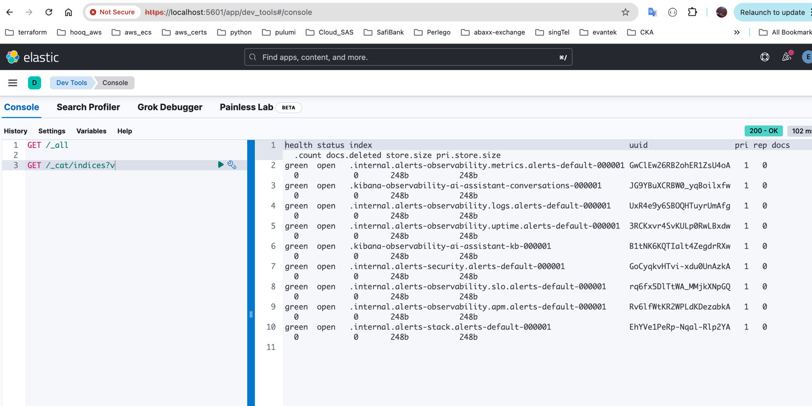
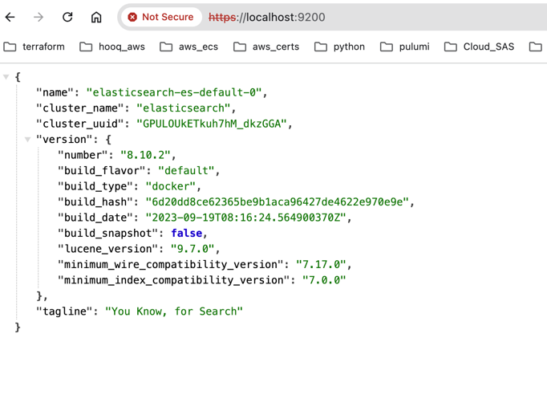

##  install k3d locally

```shell
bharathkumardasaraju@Documents$ brew install k3d
==> Auto-updating Homebrew...
Adjust how often this is run with HOMEBREW_AUTO_UPDATE_SECS or disable with
HOMEBREW_NO_AUTO_UPDATE. Hide these hints with HOMEBREW_NO_ENV_HINTS (see `man brew`).
==> Auto-updated Homebrew!
Updated 3 taps (hashicorp/tap, homebrew/core and homebrew/cask).
==> New Formulae
bc-gh                       dra                         firefly                     js-beautify                 libblastrampoline           slackdump                   wush
cmrc                        fierce                      grizzly                     jsbeautifier                pyupgrade                   spidermonkey@115
==> New Casks
blood-on-the-clocktower-online   flutterflow                      font-lxgw-simxihei               font-server-mono                 neo-network-utility              rize
choice-financial-terminal        font-ibm-plex-math               font-lxgw-simzhisong             gauntlet                         photostickies                    winbox
crosspaste                       font-ibm-plex-sans-tc            font-scientifica                 microsoft-openjdk@21             retcon                           xmenu

You have 71 outdated formulae and 4 outdated casks installed.

k3d 5.4.9 is already installed but outdated (so it will be upgraded).
==> Downloading https://ghcr.io/v2/homebrew/core/k3d/manifests/5.7.3
################################################################################################################################################################################################# 100.0%
==> Fetching k3d
==> Downloading https://ghcr.io/v2/homebrew/core/k3d/blobs/sha256:d71e3352f68f926f307af03a0567f5c452fffa64e3e367211606a40014e63e38
################################################################################################################################################################################################# 100.0%
==> Upgrading k3d
  5.4.9 -> 5.7.3
==> Pouring k3d--5.7.3.arm64_sonoma.bottle.tar.gz
==> Caveats
zsh completions have been installed to:
  /opt/homebrew/share/zsh/site-functions
==> Summary
🍺  /opt/homebrew/Cellar/k3d/5.7.3: 10 files, 23.2MB
==> Running `brew cleanup k3d`...
Disable this behaviour by setting HOMEBREW_NO_INSTALL_CLEANUP.
Hide these hints with HOMEBREW_NO_ENV_HINTS (see `man brew`).
Removing: /opt/homebrew/Cellar/k3d/5.4.9... (9 files, 18.6MB)
bharathkumardasaraju@Documents$


bharathkumardasaraju@Documents$ k3d version
k3d version v5.7.3
k3s version v1.30.3-k3s1 (default)
bharathkumardasaraju@Documents$

```

## Deploy local k8s cluster using k3d like below

```shell

bharathkumardasaraju@install-local-k8s-cluster$ cat cluster-config.yaml
apiVersion: k3d.io/v1alpha5
kind: Simple
metadata:
  name: poc-elastic-cluster
servers: 1
agents: 2
bharathkumardasaraju@install-local-k8s-cluster$ k3d cluster create --config cluster-config.yaml
INFO[0000] Using config file cluster-config.yaml (k3d.io/v1alpha5#simple)
INFO[0000] Prep: Network
INFO[0000] Created network 'k3d-poc-elastic-cluster'
INFO[0000] Created image volume k3d-poc-elastic-cluster-images
INFO[0000] Starting new tools node...
INFO[0000] Starting node 'k3d-poc-elastic-cluster-tools'
INFO[0001] Creating node 'k3d-poc-elastic-cluster-server-0'
INFO[0001] Creating node 'k3d-poc-elastic-cluster-agent-0'
INFO[0001] Creating node 'k3d-poc-elastic-cluster-agent-1'
INFO[0001] Creating LoadBalancer 'k3d-poc-elastic-cluster-serverlb'
INFO[0001] Using the k3d-tools node to gather environment information
INFO[0001] Starting new tools node...
INFO[0001] Starting node 'k3d-poc-elastic-cluster-tools'
INFO[0002] Starting cluster 'poc-elastic-cluster'
INFO[0002] Starting servers...
INFO[0002] Starting node 'k3d-poc-elastic-cluster-server-0'
INFO[0005] Starting agents...
INFO[0005] Starting node 'k3d-poc-elastic-cluster-agent-0'
INFO[0005] Starting node 'k3d-poc-elastic-cluster-agent-1'
INFO[0017] Starting helpers...
INFO[0017] Starting node 'k3d-poc-elastic-cluster-serverlb'
INFO[0023] Injecting records for hostAliases (incl. host.k3d.internal) and for 5 network members into CoreDNS configmap...
INFO[0025] Cluster 'poc-elastic-cluster' created successfully!
INFO[0025] You can now use it like this:
kubectl cluster-info
bharathkumardasaraju@install-local-k8s-cluster$ kubectl config current-context
k3d-poc-elastic-cluster
bharathkumardasaraju@install-local-k8s-cluster$ kubectl cluster-info
Kubernetes control plane is running at https://0.0.0.0:56530
CoreDNS is running at https://0.0.0.0:56530/api/v1/namespaces/kube-system/services/kube-dns:dns/proxy
Metrics-server is running at https://0.0.0.0:56530/api/v1/namespaces/kube-system/services/https:metrics-server:https/proxy

To further debug and diagnose cluster problems, use 'kubectl cluster-info dump'.
bharathkumardasaraju@install-local-k8s-cluster$ kubectl get nodes -o wide
NAME                               STATUS   ROLES                  AGE   VERSION        INTERNAL-IP   EXTERNAL-IP   OS-IMAGE           KERNEL-VERSION    CONTAINER-RUNTIME
k3d-poc-elastic-cluster-agent-0    Ready    <none>                 40s   v1.30.3+k3s1   172.20.0.4    <none>        K3s v1.30.3+k3s1   6.6.16-linuxkit   containerd://1.7.17-k3s1
k3d-poc-elastic-cluster-agent-1    Ready    <none>                 41s   v1.30.3+k3s1   172.20.0.5    <none>        K3s v1.30.3+k3s1   6.6.16-linuxkit   containerd://1.7.17-k3s1
k3d-poc-elastic-cluster-server-0   Ready    control-plane,master   51s   v1.30.3+k3s1   172.20.0.3    <none>        K3s v1.30.3+k3s1   6.6.16-linuxkit   containerd://1.7.17-k3s1
bharathkumardasaraju@install-local-k8s-cluster$

```

### instal eck-operator helm

```shell

helm repo add elastic https://helm.elastic.co
helm repo update
helm install elastic-operator elastic/eck-operator --namespace elastic-system --create-namespace


bharathkumardasaraju@install-local-k8s-cluster$ helm search repo elastic/eck-operator --versions

NAME                     	CHART VERSION	APP VERSION	DESCRIPTION
elastic/eck-operator     	2.14.0       	2.14.0     	Elastic Cloud on Kubernetes (ECK) operator
elastic/eck-operator     	2.13.0       	2.13.0     	Elastic Cloud on Kubernetes (ECK) operator
elastic/eck-operator     	2.12.1       	2.12.1     	Elastic Cloud on Kubernetes (ECK) operator
elastic/eck-operator     	2.12.0       	2.12.0     	Elastic Cloud on Kubernetes (ECK) operator
elastic/eck-operator     	2.11.1       	2.11.1     	Elastic Cloud on Kubernetes (ECK) operator
elastic/eck-operator     	2.11.0       	2.11.0     	Elastic Cloud on Kubernetes (ECK) operator
elastic/eck-operator     	2.10.0       	2.10.0     	Elastic Cloud on Kubernetes (ECK) operator
elastic/eck-operator     	2.9.0        	2.9.0      	Elastic Cloud on Kubernetes (ECK) operator
elastic/eck-operator     	2.8.0        	2.8.0      	Elastic Cloud on Kubernetes (ECK) operator
elastic/eck-operator     	2.7.0        	2.7.0      	A Helm chart for deploying the Elastic Cloud on...
elastic/eck-operator     	2.6.1        	2.6.1      	A Helm chart for deploying the Elastic Cloud on...
elastic/eck-operator     	2.6.0        	2.6.0      	A Helm chart for deploying the Elastic Cloud on...
elastic/eck-operator     	2.5.0        	2.5.0      	A Helm chart for deploying the Elastic Cloud on...
elastic/eck-operator     	2.4.0        	2.4.0      	A Helm chart for deploying the Elastic Cloud on...
elastic/eck-operator     	2.3.0        	2.3.0      	A Helm chart for deploying the Elastic Cloud on...
elastic/eck-operator     	2.2.0        	2.2.0      	A Helm chart for deploying the Elastic Cloud on...
elastic/eck-operator     	2.1.0        	2.1.0      	A Helm chart for deploying the Elastic Cloud on...
elastic/eck-operator     	2.0.0        	2.0.0      	A Helm chart for deploying the Elastic Cloud on...
elastic/eck-operator     	1.9.1        	1.9.1      	A Helm chart for deploying the Elastic Cloud on...
elastic/eck-operator     	1.9.0        	1.9.0      	A Helm chart for deploying the Elastic Cloud on...
elastic/eck-operator     	1.8.0        	1.8.0      	A Helm chart for deploying the Elastic Cloud on...
elastic/eck-operator     	1.7.1        	1.7.1      	A Helm chart for deploying the Elastic Cloud on...
elastic/eck-operator     	1.7.0        	1.7.0      	A Helm chart for deploying the Elastic Cloud on...
elastic/eck-operator     	1.6.0        	1.6.0      	A Helm chart for deploying the Elastic Cloud on...
elastic/eck-operator     	1.5.0        	1.5.0      	A Helm chart for deploying the Elastic Cloud on...
elastic/eck-operator     	1.4.1        	1.4.1      	A Helm chart for deploying the Elastic Cloud on...
elastic/eck-operator     	1.4.0        	1.4.0      	A Helm chart for deploying the Elastic Cloud on...
elastic/eck-operator     	1.3.1        	1.3.1      	A Helm chart for deploying the Elastic Cloud on...
elastic/eck-operator     	1.3.0        	1.3.0      	A Helm chart for deploying the Elastic Cloud on...
elastic/eck-operator-crds	2.14.0       	2.14.0     	ECK operator Custom Resource Definitions
elastic/eck-operator-crds	2.13.0       	2.13.0     	ECK operator Custom Resource Definitions
elastic/eck-operator-crds	2.12.1       	2.12.1     	ECK operator Custom Resource Definitions
elastic/eck-operator-crds	2.12.0       	2.12.0     	ECK operator Custom Resource Definitions
elastic/eck-operator-crds	2.11.1       	2.11.1     	ECK operator Custom Resource Definitions
elastic/eck-operator-crds	2.11.0       	2.11.0     	ECK operator Custom Resource Definitions
elastic/eck-operator-crds	2.10.0       	2.10.0     	ECK operator Custom Resource Definitions
elastic/eck-operator-crds	2.9.0        	2.9.0      	ECK operator Custom Resource Definitions
elastic/eck-operator-crds	2.8.0        	2.8.0      	ECK operator Custom Resource Definitions
elastic/eck-operator-crds	2.7.0        	2.7.0      	A Helm chart for installing the ECK operator Cu...
elastic/eck-operator-crds	2.6.1        	2.6.1      	A Helm chart for installing the ECK operator Cu...
elastic/eck-operator-crds	2.6.0        	2.6.0      	A Helm chart for installing the ECK operator Cu...
elastic/eck-operator-crds	2.5.0        	2.5.0      	A Helm chart for installing the ECK operator Cu...
elastic/eck-operator-crds	2.4.0        	2.4.0      	A Helm chart for installing the ECK operator Cu...
elastic/eck-operator-crds	2.3.0        	2.3.0      	A Helm chart for installing the ECK operator Cu...
elastic/eck-operator-crds	2.2.0        	2.2.0      	A Helm chart for installing the ECK operator Cu...
elastic/eck-operator-crds	2.1.0        	2.1.0      	A Helm chart for installing the ECK operator Cu...
elastic/eck-operator-crds	2.0.0        	2.0.0      	A Helm chart for installing the ECK operator Cu...
elastic/eck-operator-crds	1.9.1        	1.9.1      	A Helm chart for installing the ECK operator Cu...
elastic/eck-operator-crds	1.9.0        	1.9.0      	A Helm chart for installing the ECK operator Cu...
elastic/eck-operator-crds	1.8.0        	1.8.0      	A Helm chart for installing the ECK operator Cu...
elastic/eck-operator-crds	1.7.1        	1.7.1      	A Helm chart for installing the ECK operator Cu...
elastic/eck-operator-crds	1.7.0        	1.7.0      	A Helm chart for installing the ECK operator Cu...
elastic/eck-operator-crds	1.6.0        	1.6.0      	A Helm chart for installing the ECK operator Cu...
elastic/eck-operator-crds	1.5.0        	1.5.0      	A Helm chart for installing the ECK operator Cu...
elastic/eck-operator-crds	1.4.1        	1.4.1      	A Helm chart for installing the ECK operator Cu...
elastic/eck-operator-crds	1.4.0        	1.4.0      	A Helm chart for installing the ECK operator Cu...
elastic/eck-operator-crds	1.3.1        	1.3.1      	A Helm chart for installing the ECK operator Cu...
elastic/eck-operator-crds	1.3.0        	1.3.0      	A Helm chart for installing the ECK operator Cu...
bharathkumardasaraju@install-local-k8s-cluster$

```

### eck-operator

```shell
bharathkumardasaraju@install-local-k8s-cluster$ helm install elastic-operator elastic/eck-operator --namespace elastic-system --create-namespace
NAME: elastic-operator
LAST DEPLOYED: Sat Sep  7 08:35:57 2024
NAMESPACE: elastic-system
STATUS: deployed
REVISION: 1
TEST SUITE: None
NOTES:
1. Inspect the operator logs by running the following command:
   kubectl logs -n elastic-system sts/elastic-operator
bharathkumardasaraju@install-local-k8s-cluster$ helm list -n elastic-system
NAME            	NAMESPACE     	REVISION	UPDATED                             	STATUS  	CHART              	APP VERSION
elastic-operator	elastic-system	1       	2024-09-07 08:35:57.108233 +0800 +08	deployed	eck-operator-2.14.0	2.14.0
bharathkumardasaraju@install-local-k8s-cluster$


harathkumardasaraju@install-local-k8s-cluster$ kubectl get all -n elastic-system
NAME                     READY   STATUS    RESTARTS   AGE
pod/elastic-operator-0   1/1     Running   0          100s

NAME                               TYPE        CLUSTER-IP    EXTERNAL-IP   PORT(S)   AGE
service/elastic-operator-webhook   ClusterIP   10.43.94.81   <none>        443/TCP   100s

NAME                                READY   AGE
statefulset.apps/elastic-operator   1/1     100s
bharathkumardasaraju@install-local-k8s-cluster$


bharathkumardasaraju@manifests$ kubectl get all -n elastic-system
NAME                             READY   STATUS    RESTARTS   AGE
pod/bharath-test                 1/1     Running   0          7h55m
pod/elastic-operator-0           1/1     Running   0          8h
pod/elasticsearch-es-default-0   1/1     Running   0          7h45m
pod/kibana-kb-fc479df8-295v9     1/1     Running   0          7h46m

NAME                                     TYPE        CLUSTER-IP    EXTERNAL-IP   PORT(S)    AGE
service/elastic-operator-webhook         ClusterIP   10.43.94.81   <none>        443/TCP    8h
service/elasticsearch-es-default         ClusterIP   None          <none>        9200/TCP   8h
service/elasticsearch-es-http            ClusterIP   10.43.22.96   <none>        9200/TCP   8h
service/elasticsearch-es-internal-http   ClusterIP   10.43.96.15   <none>        9200/TCP   8h
service/elasticsearch-es-transport       ClusterIP   None          <none>        9300/TCP   8h
service/kibana-kb-http                   ClusterIP   10.43.122.9   <none>        5601/TCP   8h

NAME                        READY   UP-TO-DATE   AVAILABLE   AGE
deployment.apps/kibana-kb   1/1     1            1           8h

NAME                                   DESIRED   CURRENT   READY   AGE
replicaset.apps/kibana-kb-7fc74f94bb   0         0         0       8h
replicaset.apps/kibana-kb-fc479df8     1         1         1       7h46m

NAME                                        READY   AGE
statefulset.apps/elastic-operator           1/1     8h
statefulset.apps/elasticsearch-es-default   1/1     8h
bharathkumardasaraju@manifests$

```

### install elastic and kibana

```shell
bharathkumardasaraju@install-eck-operator$ kubectl apply -k manifests
elasticsearch.elasticsearch.k8s.elastic.co/elasticsearch created
kibana.kibana.k8s.elastic.co/kibana created
bharathkumardasaraju@install-eck-operator$

```

### Login to elasticsearch

```shell

# get the default elastic user password first

bharathkumardasaraju@~$ kubectl -n elastic-system get secret elasticsearch-es-elastic-user -o jsonpath="{.data.elastic }" | base64 -d
m7Xu34qrFEGq4119FMWs377y
bharathkumardasaraju@~$


bharathkumardasaraju@manifests$ kubectl port-forward -n elastic-system service/elasticsearch-es-http 9200
Forwarding from 127.0.0.1:9200 -> 9200
Forwarding from [::1]:9200 -> 9200
Handling connection for 9200
Handling connection for 9200
Handling connection for 9200
Handling connection for 9200
Handling connection for 9200
Handling connection for 9200


bharathkumardasaraju@~$ curl -u "elastic:m7Xu34qrFEGq4119FMWs377y" -k "https://localhost:9200"
{
  "name" : "elasticsearch-es-default-0",
  "cluster_name" : "elasticsearch",
  "cluster_uuid" : "GPULOUkETkuh7hM_dkzGGA",
  "version" : {
    "number" : "8.10.2",
    "build_flavor" : "default",
    "build_type" : "docker",
    "build_hash" : "6d20dd8ce62365be9b1aca96427de4622e970e9e",
    "build_date" : "2023-09-19T08:16:24.564900370Z",
    "build_snapshot" : false,
    "lucene_version" : "9.7.0",
    "minimum_wire_compatibility_version" : "7.17.0",
    "minimum_index_compatibility_version" : "7.0.0"
  },
  "tagline" : "You Know, for Search"
}
bharathkumardasaraju@~$

```

### Login to kibana locally

```shell

# get the default elastic user password first

bharathkumardasaraju@~$ kubectl -n elastic-system get secret elasticsearch-es-elastic-user -o jsonpath="{.data.elastic }" | base64 -d
m7Xu34qrFEGq4119FMWs377y
bharathkumardasaraju@~$


bharathkumardasaraju@~$ kubectl port-forward service/kibana-kb-http 5601 -n elastic-system
Forwarding from 127.0.0.1:5601 -> 5601
Forwarding from [::1]:5601 -> 5601
Handling connection for 5601
Handling connection for 5601
Handling connection for 5601
Handling connection for 5601
Handling connection for 5601
Handling connection for 5601
Handling connection for 5601

```

### Kibana Console


### Elasticsearch Cluster Health



### List system indexes using curl

```shell
bharathkumardasaraju@~$ curl -XGET -u "elastic:m7Xu34qrFEGq4119FMWs377y" -k "https://localhost:9200/_cat/indices?v" -H "kbn-xsrf: reporting"
health status index                                                        uuid                   pri rep docs.count docs.deleted store.size pri.store.size
green  open   .internal.alerts-observability.metrics.alerts-default-000001 GwClEw26RB2ohER1ZsU4oA   1   0          0            0       248b           248b
green  open   .kibana-observability-ai-assistant-conversations-000001      JG9YBuXCRBW0_yqBoilxfw   1   0          0            0       248b           248b
green  open   .internal.alerts-observability.logs.alerts-default-000001    UxR4e9y6SBOQHTuyrUmAfg   1   0          0            0       248b           248b
green  open   .internal.alerts-observability.uptime.alerts-default-000001  3RCKxvr4SvKULp0RwLBxdw   1   0          0            0       248b           248b
green  open   .kibana-observability-ai-assistant-kb-000001                 B1tNK6KQTIalt4ZegdrRXw   1   0          0            0       248b           248b
green  open   .internal.alerts-security.alerts-default-000001              GoCyqkvHTvi-xdu0UnAzkA   1   0          0            0       248b           248b
green  open   .internal.alerts-observability.slo.alerts-default-000001     rq6fx5DlTtWA_MMjkXNpGQ   1   0          0            0       248b           248b
green  open   .internal.alerts-observability.apm.alerts-default-000001     Rv6lfWtKR2WPLdKDezabkA   1   0          0            0       248b           248b
green  open   .internal.alerts-stack.alerts-default-000001                 EhYVe1PeRp-Nqal-Rlp2YA   1   0          0            0       248b           248b
bharathkumardasaraju@~$

```